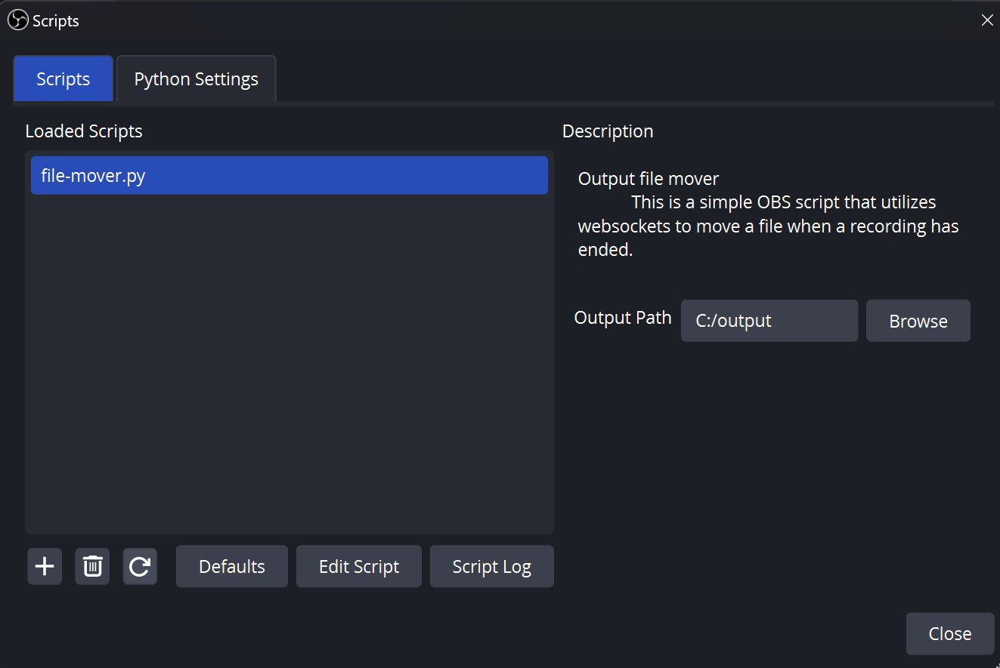
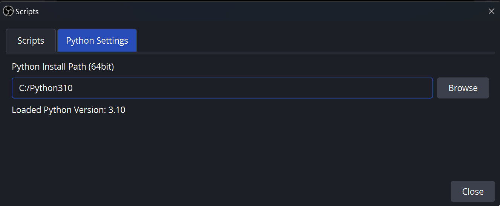
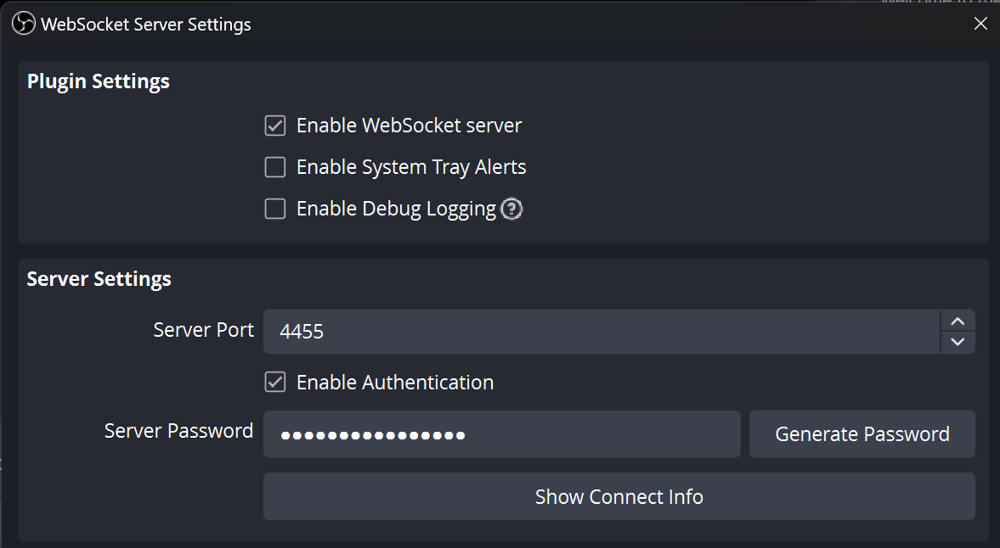

# obs-script-file-mover

# Setup

Summary of steps required to successfully use this Python script in OBS

* [Setup the Python path in OBS](#Setup-the-Python-path-in-OBS)
* [Install the python script dependencies](#Install-the-python-script-dependencies)
* [Enable & Configure OBS WebSockets](#Enable-and-Configure-OBS-WebSockets)
* [Load the script in OBS](#Load-the-script-in-OBS)

### Setup the Python path in OBS

Python must be loaded in OBS in order to use Python scripts within OBS. As per the OBS Docs

> For Python scripts, a decent distribution of Python must be installed by the user, and the Python Install Path must be set in the tab Python Settings.

This is done via Tools -> Scripts -> Python Settings

### Install the python script dependencies

Download/clone this project to your machine and run the following python command to install packages

> pip install -r requirements.txt

### Enable and Configure OBS WebSockets

In OBS, go to Tools -> WebSocket Server Settings and tick "Enable WebSocket server". If you do not see this option, you are running an old version of OBS ([obs-websocket is now included by default with OBS Studio 28.0.0 and above](https://github.com/obsproject/obs-websocket)).

Take note of password you have configured, replace the password in the [config.toml](config.toml) file in this project and move this file into your user home directory. E.g. C:\Users\MyProfileName

### Load the script in OBS

In OBS, go to Tools -> Scripts, click the + symbol and select the [obs-file-mover.py](obs-file-mover.py) file.

Good luck!

# Resources

Getting started with OBS Scripting - https://obsproject.com/wiki/Getting-Started-With-OBS-Scripting

Python SDK for OBS Studio WebSocket - https://pypi.org/project/obsws-python/

OBS Core API - https://docs.obsproject.com/reference-core-objects